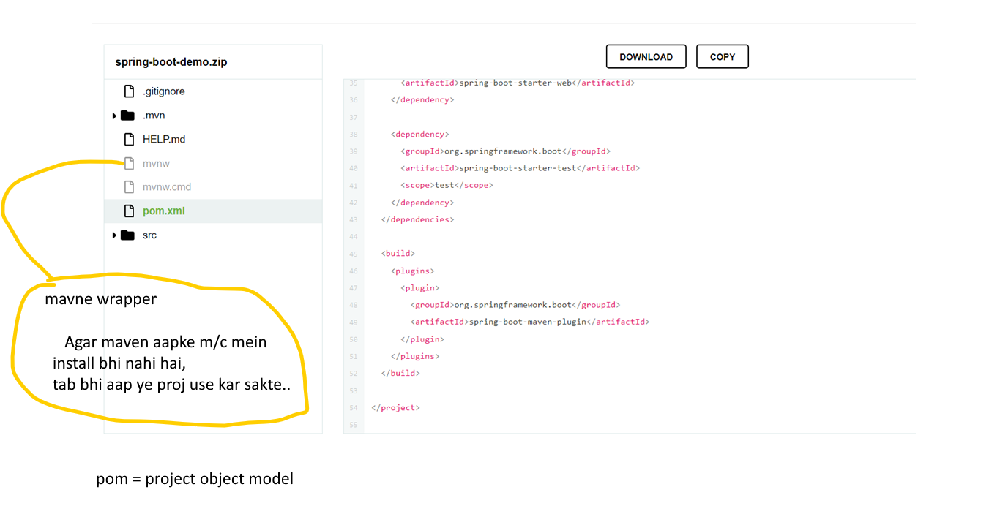
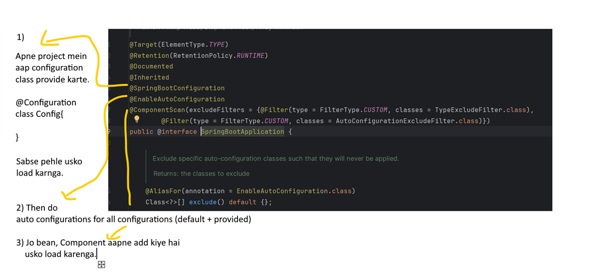
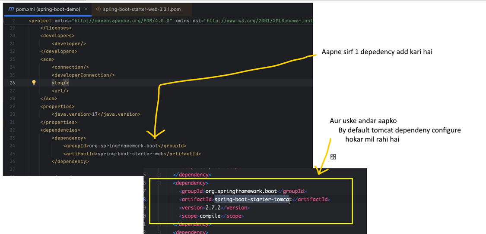
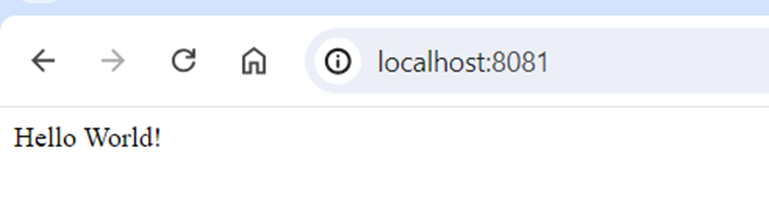
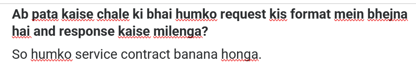

# Section-1
# 1. Intro
Section Name Repo URL
## Introduction to Spring Boot
- https://github.com/shabbirdwd53/spring-bootmicroservices
## Restful Web Services with Spring Boot 
- https://github.com/shabbirdwd53/spring-bootmicroservices
## Spring Data JPA with Spring Boot 
- https://github.com/shabbirdwd53/spring-bootmicroservices
## Microservices Implementation 
- https://github.com/shabbirdwd53/spring-bootmicroservices
## Docker with Microservices 
- https://github.com/shabbirdwd53/spring-bootmicroservices/
tree/docker
## Kubernetes with Microservices 
- https://github.com/shabbirdwd53/spring-bootmicroservices/
tree/kubernetes
## Kubernetes without Service Registry
-  https://github.com/shabbirdwd53/spring-bootmicroservices/

## OrderService 
- https://github.com/shabbirdwd53/OrderServic
e
## PaymentService 
- https://github.com/shabbirdwd53/PaymentSer
vice
## ProductService
-  https://github.com/shabbirdwd53/ProductServ
ice
## CloudGateway 
- https://github.com/shabbirdwd53/CloudGatew
ay
## ConfigServer
-  https://github.com/shabbirdwd53/ConfigServe
r
## ms-initial-setup 
- https://github.com/shabbirdwd53/ms-initial-set
up
# Section-2
# 3 Intro to Spring boot?
- jab java introduced hua to log java EE edition like jsp, servelet concept use karke app banane lage.
- uske upar kayi sare framework aaye like Struts, live Free, Spring
- Spring famous tha but ismee lot of configuration karna padta tha.
- So spring boot introduced to reduce the headache.
# 4 What is dependency injection?

# 5. Spring Intializer

# 6. Setting up ide for the spring boot project

# 7. Creating First HelloWorld Api
### We are creating Rest endpoint to serve the request.
- we are going to create a controller which handle http request 

# 8. Spring boot Starters Project

# 9. Understanding Spring Boot Magic
### How Spring-boot works internally?

### Agar aapko apne project mein jpa use karna hai so kya karna honga?

### Q)Spring ko pata kaise chal rha hai ki property provide karni hai?

### Q)  How about running your application?

### About @SpringBootConfiguration annotation

### About run() method
#### This run method help you to start your application.

# 10. Embedded Server
### ***Normal flow***

### ***Inside pom.xml***

### ***Agar hume Jetty  server use karna ho tab?***

#### Remember:

### ***Remove Manually***

### ***Add jetty server dependency***

### ***Change port:***

### ***Exculsion automatically kaise kare***
#### Add plugin

#### After removing all tomcat exclusion
####  Hum automatically exclusion karenge

# 11. Exploring Spring boot actuator

# 12. Exploring Spring Boot dev tools.

# Section-3

