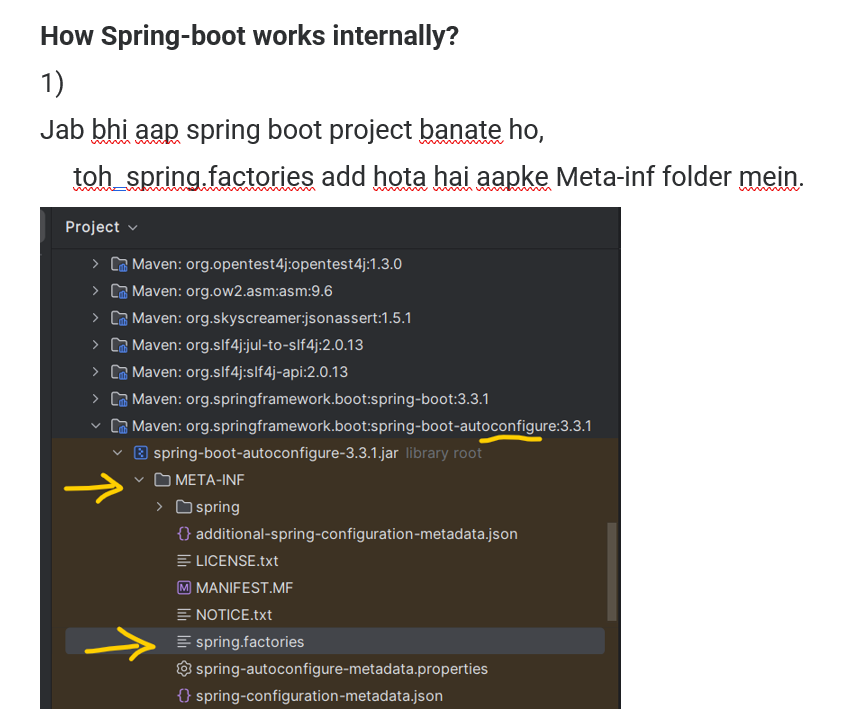
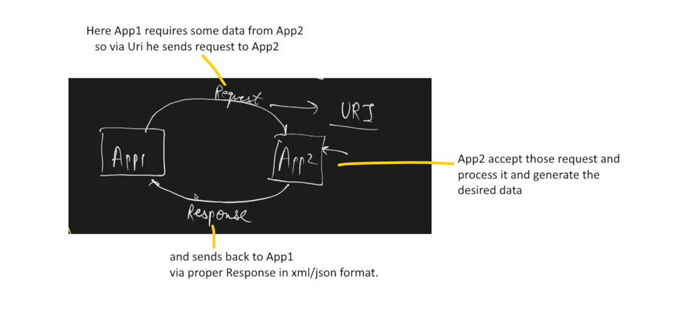
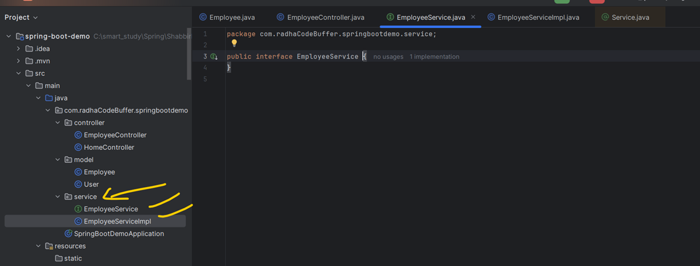
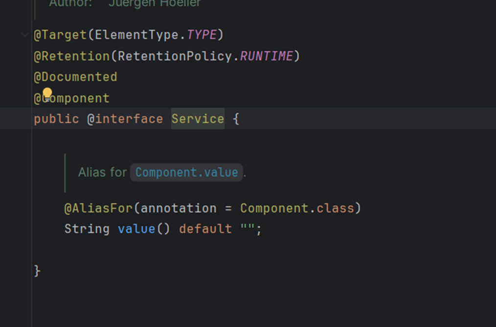
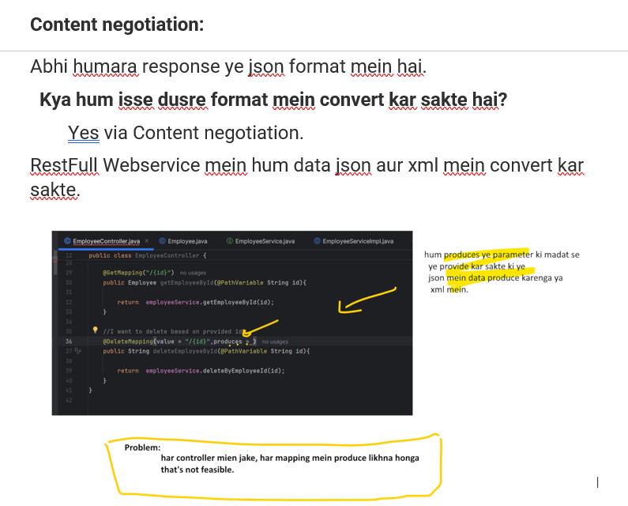
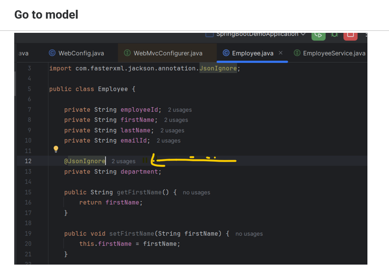
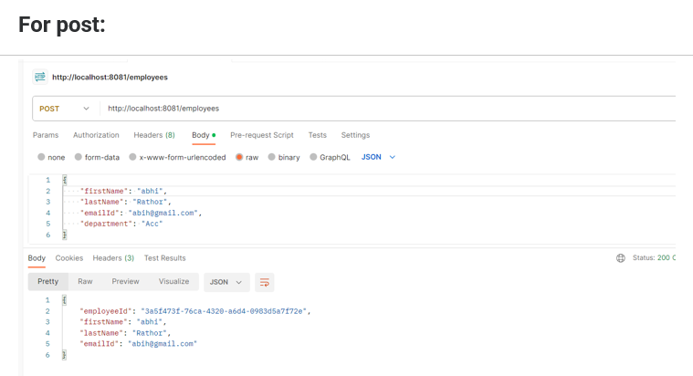
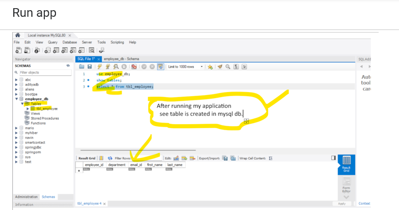
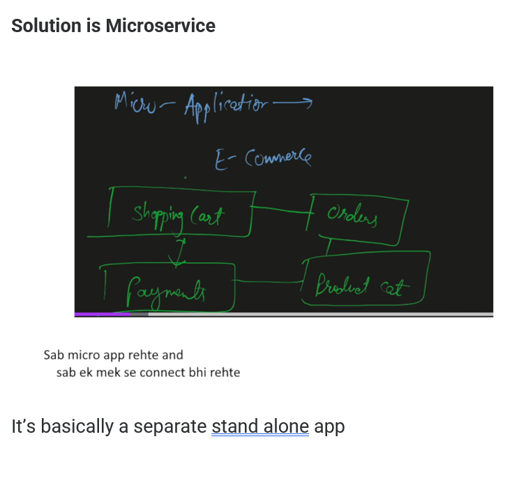
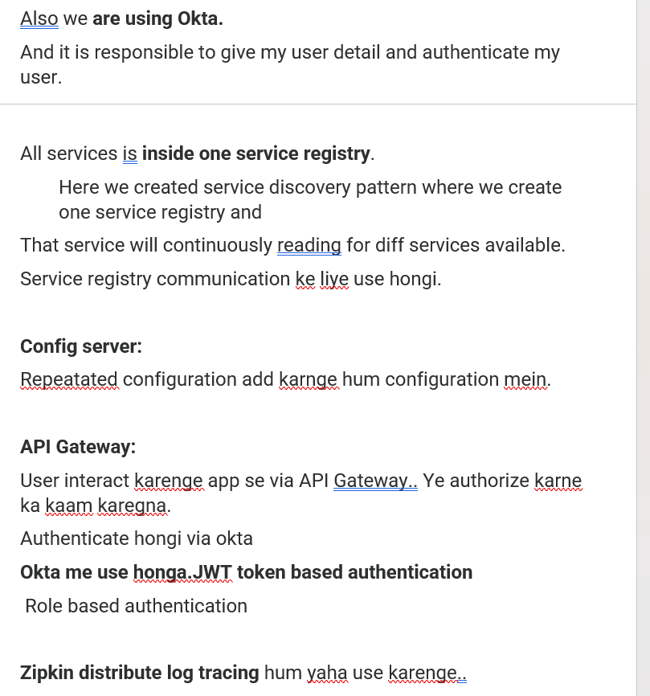

# Section-1
# 1. Intro
Section Name Repo URL
## Introduction to Spring Boot
- https://github.com/shabbirdwd53/spring-bootmicroservices
## Restful Web Services with Spring Boot 
- https://github.com/shabbirdwd53/spring-bootmicroservices
## Spring Data JPA with Spring Boot 
- https://github.com/shabbirdwd53/spring-bootmicroservices
## Microservices Implementation 
- https://github.com/shabbirdwd53/spring-bootmicroservices
## Docker with Microservices 
- https://github.com/shabbirdwd53/spring-bootmicroservices/
tree/docker
## Kubernetes with Microservices 
- https://github.com/shabbirdwd53/spring-bootmicroservices/
tree/kubernetes
## Kubernetes without Service Registry
-  https://github.com/shabbirdwd53/spring-bootmicroservices/

## OrderService 
- https://github.com/shabbirdwd53/OrderServic
e
## PaymentService 
- https://github.com/shabbirdwd53/PaymentSer
vice
## ProductService
-  https://github.com/shabbirdwd53/ProductServ
ice
## CloudGateway 
- https://github.com/shabbirdwd53/CloudGatew
ay
## ConfigServer
-  https://github.com/shabbirdwd53/ConfigServe
r
## ms-initial-setup 
- https://github.com/shabbirdwd53/ms-initial-set
up
# Section-2
# 3 Intro to Spring boot?
- jab java introduced hua to log java EE edition like jsp, servelet concept use karke app banane lage.
- uske upar kayi sare framework aaye like Struts, live Free, Spring
- Spring famous tha but ismee lot of configuration karna padta tha.
- So spring boot introduced to reduce the headache.
# 4 What is dependency injection?

# 5. Spring Intializer

# 6. Setting up ide for the spring boot project

# 7. Creating First HelloWorld Api
### We are creating Rest endpoint to serve the request.
- we are going to create a controller which handle http request 


# 8. Spring boot Starters Project

# 9. Understanding Spring Boot Magic
### How Spring-boot works internally?

### Agar aapko apne project mein jpa use karna hai so kya karna honga?

### Q)Spring ko pata kaise chal rha hai ki property provide karni hai?

### Q)  How about running your application?

### About @SpringBootConfiguration annotation

### About run() method
#### This run method help you to start your application.

# 10. Embedded Server
### ***Normal flow***

### ***Inside pom.xml***

### ***Agar hume Jetty  server use karna ho tab?***

#### Remember:

### ***Remove Manually***

### ***Add jetty server dependency***

### ***Change port:***

### ***Exculsion automatically kaise kare***
#### Add plugin

#### After removing all tomcat exclusion
####  Hum automatically exclusion karenge

# 11. Exploring Spring boot actuator

# 12. Exploring Spring Boot dev tools.


# Section-3


# Section-4
# 16. What is rest?

# 17. Creating a hello world service?


# 18. Enhancing Hello World Servie to return an Object?
## Target:Create a new endpoint where we can handle the object.
### Create a User class which have some fields and return that user


### Varaition-1
#### by default it's always Get method

### What happen if you define this method as post.

### Var-2

# 19. Working with Path variables?
## Path variable is a path that you define in Uri.

## U can also define multiple path variables.

## Hume name pasand nhi hai varible ka path parameter wale.. hum change karenge

# 20. Working with Request Params?
```
When data is mandatory u take it using Path variable
When data is not mandatory u take it using Request Parameter
Request Parameter is defined with ? ie. query parameter
and multiple query parameter are separated by &
````

## Var-2

## Var-3 ab hume sirf email chaiye na ki emailId

## Var-4 if i don't want email as a mandatory thing, agar hum nahi bhi de to kaam chal jave

## Var-5 i don't wont to pass email id and also don't wont null retrun

# 21. Impelementing Post method to create Employee Resource.



### Employee class
```java
package com.radhaCodeBuffer.springbootdemo.model;

public class Employee {

    private String employeeId;
    private String firstName;
    private String lastName;
    private String emailId;
    private String department;

    public String getFirstName() {
        return firstName;
    }

    public void setFirstName(String firstName) {
        this.firstName = firstName;
    }

    public String getLastName() {
        return lastName;
    }

    public void setLastName(String lastName) {
        this.lastName = lastName;
    }

    public String getEmailId() {
        return emailId;
    }

    public void setEmailId(String emailId) {
        this.emailId = emailId;
    }

    public String getDepartment() {
        return department;
    }

    public void setDepartment(String department) {
        this.department = department;
    }

    public String getEmployeeId() {
        return employeeId;
    }

    public void setEmployeeId(String employeeId) {
        this.employeeId = employeeId;
    }
}
```
### Employee Controller
```java
package com.radhaCodeBuffer.springbootdemo.controller;

import com.radhaCodeBuffer.springbootdemo.model.Employee;
import com.radhaCodeBuffer.springbootdemo.service.EmployeeService;
import org.springframework.beans.factory.annotation.Autowired;
import org.springframework.web.bind.annotation.PostMapping;
import org.springframework.web.bind.annotation.RequestBody;
import org.springframework.web.bind.annotation.RequestMapping;
import org.springframework.web.bind.annotation.RestController;

@RestController
@RequestMapping("/employees")
public class EmployeeController {

    @Autowired
    private EmployeeService employeeService;

    @PostMapping
    public Employee save(@RequestBody Employee employee){

        return  employeeService.save(employee);
    }
}
```
### EmployeeService
```java
package com.radhaCodeBuffer.springbootdemo.service;

import com.radhaCodeBuffer.springbootdemo.model.Employee;

public interface EmployeeService {

    Employee save(Employee employee);
}
```
### EmployeeServiceImpl
```java
package com.radhaCodeBuffer.springbootdemo.service;

import com.radhaCodeBuffer.springbootdemo.model.Employee;
import org.springframework.stereotype.Service;

import java.util.ArrayList;
import java.util.List;
import java.util.UUID;

@Service
public class EmployeeServiceImpl implements EmployeeService{

    //I will store here in List
    List<Employee> employees = new ArrayList<>();

    @Override
    public Employee save(Employee employee) {

        //check for employeeId if null or empty then generate employeeId
        if(employee.getEmployeeId() == null ||
            employee.getEmployeeId().isEmpty()){

            employee.setEmployeeId(UUID.randomUUID().toString());
        }
        employees.add(employee);

        return employee;
    }
}
```
# 22. Implementing get method for employee resource.

# 23. Implementing get method for employee by id.

# 24. Implementing exception handling- 404 resourece not found.

# 25. Implementing Generic Exception for all resource.

# 26. Implementing delete method to delete a Employee resource.

# 27. Content Negotiation: Impelmenting support for xml and json.

## 28. Implementing Data filtering for restful services.

# 29. API Versioning

# Section-5 JPA with boot
# 30. What is JPA with Rest API?

# 31. Setting up JPA and different classes?

# 32. Create Employee Post method with JPA.

# 33. Get Employee Data from DB with JPA.

# 34. Delete Employee Data with JPA.

# 35. Converting h2 db to mysql db.

# Section -6 Microservice Intro
# 36. All About the microservices.

# Section-7 Microservices Implementation
# 37. Overview of implementing microservice architecture.

# 38. What is Service Registry?

# 39. Creating Product Service?

# 40. IMplementing Create Product API?

# 41. Implementing Get Product API.

# 42. Exception Handling in product Service.
